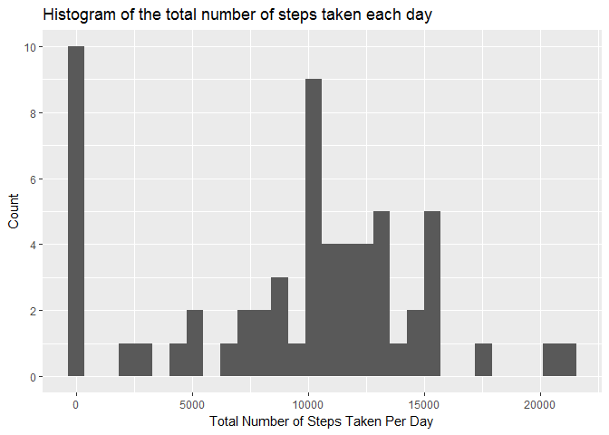
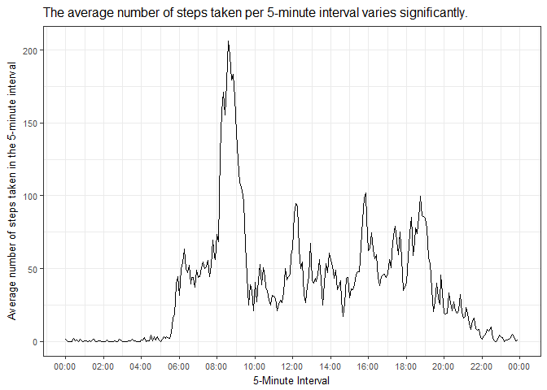
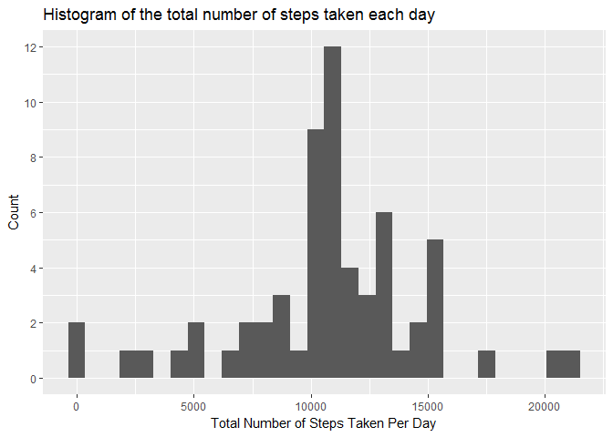
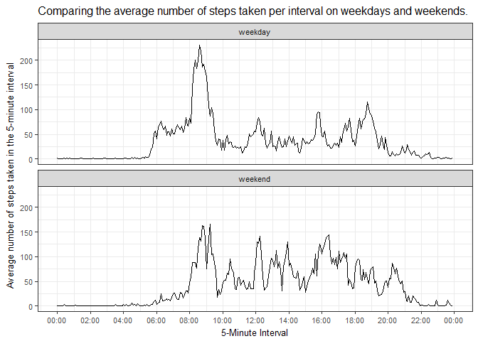

# Reproducible Research: Peer Assessment 1


## Loading and preprocessing the data

```r
## load the libraries required (and suppress messages so that they don't appear in R Markdown)
suppressMessages(library(ggplot2)) 
suppressMessages(library(dplyr))
suppressMessages(library(scales))

## unzips the activity.zip file and reports an error if itsn't found.
if(!file.exists("./activity.zip")){print("Error - activity zip file is not in working directory.")}
unzip(zipfile="./activity.zip", exdir=".")

## reads the csv file and creates an 'intervalAsTime' variable which is easier to plot than
## the original interval variable.
activity <- read.csv("activity.csv", colClasses = c("integer", "Date", "integer"))
activity$intervalAsTime <- as.POSIXct(sprintf("%04d", activity$interval), format="%H%M")
```

## What is mean total number of steps taken per day?
### Calculate the total number of steps taken per day:

```r
dailyTotals <- group_by(activity, date) %>%
    summarise(TotalSteps = sum(steps, na.rm=TRUE))
```

### Generate a histogram of the total number of steps taken each day:

```r
ggplot(dailyTotals, aes(TotalSteps)) +
    geom_histogram(bins=30) + 
    scale_y_continuous(breaks=pretty_breaks()) +
    labs(x="Total Number of Steps Taken Per Day", y="Count", 
         title="Histogram of the total number of steps taken each day")
```

<!-- -->

### Calculate and report the mean and median of the total number of steps taken per day:

```r
meanDailySteps <- mean(dailyTotals$TotalSteps) 
medianDailySteps <- median(dailyTotals$TotalSteps)
```
The mean number of steps taken per day was 9354.2295082.  
The median number of steps taken per day was 10395.


## What is the average daily activity pattern?
### Make a time series plot of the 5-minute interval and the average number of steps taken, averaged across all days:

```r
intervalAverages <- group_by(activity, interval, intervalAsTime) %>%
    summarise(MeanSteps = mean(steps, na.rm=TRUE))

ggplot(data=intervalAverages, aes(intervalAsTime, MeanSteps)) +
    geom_line() + ## adds the bargraphs to the plot, with the fill showing the EI.Sector
    labs(x = "5-Minute Interval", y = "Average number of steps taken in the 5-minute interval", 
         title="The average number of steps taken per 5-minute interval varies significantly.") +
    theme_bw() + theme(text = element_text(size=10)) +
    scale_y_continuous(labels = comma_format()) + scale_x_datetime(date_breaks="2 hours", date_labels="%H:%M")
```

<!-- -->

### Which 5-minute interval, on average across all the days in the dataset, contains the maximum number of steps?  

```r
MaxInterval <- intervalAverages[which.max(intervalAverages$MeanSteps),]$interval
```
The 5-minute interval, on average across all the days in the dataset, containing 
the maximum number of steps was 835.  

## Imputing missing values
### Calculate and report the total number of missing values in the dataset:

```r
NumValuesMissing <- sum(is.na(activity))
```
The total number of missing values in the dataset was 2304.  

### Devise a strategy for filling in all of the missing values:
Analysis of the dataset shows that 8 out of the 61 days in the datset are missing
data.  Therefore I've decided to fill in all of the missing values by 
imputing the mean value for each 5-minute interval.  

### Create a new dataset with the missing data filled in:

```r
revisedActivity <- activity %>%
    mutate(steps = ifelse(is.na(steps), 
            (intervalAverages[match(interval, intervalAverages$interval),])$MeanSteps, 
            steps))
```

### Create a new histogram, and recalculate the mean and median total number of steps per day.  Describe the impact of the imputing the data:

```r
revisedDailyTotals <- group_by(revisedActivity, date) %>%
    summarise(TotalSteps = sum(steps))

ggplot(revisedDailyTotals, aes(TotalSteps)) +
    geom_histogram(bins=30) + 
    scale_y_continuous(breaks=pretty_breaks()) +
    labs(x="Total Number of Steps Taken Per Day", y="Count", 
         title="Histogram of the total number of steps taken each day")
```

<!-- -->

```r
revisedMeanDailySteps <- mean(revisedDailyTotals$TotalSteps) 
revisedMedianDailySteps <- median(revisedDailyTotals$TotalSteps)
```
By filling in the missing values, the total daily steps mean in the new dataset is 1.0766189\times 10^{4}, a significant increase from the original mean.  The revised median has increased as well (although not by as much as the mean) and is 1.0766189\times 10^{4}.  The eight days that had missing values all now have the same total steps per day and this can be seen in the histogram (you can see that the number of days with fewer than 500 total steps per day has dropped by 8 and the number with  10,500 - 11,500 daily steps has increased by 8).  

## Are there differences in activity patterns between weekdays and weekends?
### Create a new weekday/weekend factor variable in the revised dataset

```r
revisedActivity <- revisedActivity %>%
    mutate(dayType = factor(case_when(
        weekdays(.$date) %in% c("Saturday", "Sunday") ~ "weekend",
        weekdays(.$date) %in% c("Monday", "Tuesday", "Wednesday", "Thursday", "Friday") ~ "weekday")))
```

### Create a timeseries panel plot showing the average number of steps taken per 5-minute interval over weekends and weekdays.

```r
revisedIntervalAverages <- group_by(revisedActivity, interval, intervalAsTime, dayType) %>%
    summarise(MeanSteps = mean(steps, na.rm=TRUE))

ggplot(data=revisedIntervalAverages, aes(intervalAsTime, MeanSteps)) +
    geom_line() + ## adds the bargraphs to the plot, with the fill showing the EI.Sector
    labs(x = "5-Minute Interval", y = "Average number of steps taken in the 5-minute interval", 
         title="Comparing the average number of steps taken per interval on weekdays and weekends.") +
    theme_bw() + theme(text = element_text(size=10)) +
    scale_y_continuous(labels = comma_format()) + scale_x_datetime(date_breaks="2 hours", date_labels="%H:%M") +
    facet_wrap(~dayType, nrow=2)
```

<!-- -->
